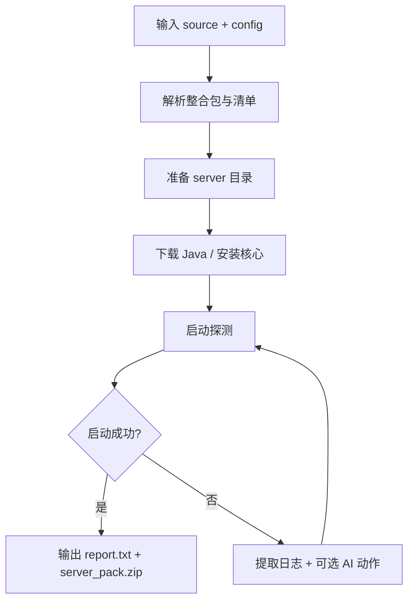

# MC Auto Server Builder

面向 Minecraft 整合包的自动化服务端构建工具。给定本地 ZIP、CurseForge 或 Modrinth 输入后，自动完成下载、整理、启动探测、日志提取与服务端打包。

- 项目名：`mc-auto-server-builder`
- Python：`>=3.10`
- 许可证：`GPL-3.0-only`
- CLI 入口：`mcasb`

核心实现入口：[`main()`](src/mc_auto_server_builder/cli.py#L24)、[`ServerBuilder.run()`](src/mc_auto_server_builder/builder.py#L2129)

---

## 特性概览

- 支持多种输入源（本地 ZIP / CurseForge / Modrinth）
- 自动识别并解析整合包清单（`manifest.json` / `modrinth.index.json`）
- 自动准备服务端目录，合并 overrides 并清理客户端侧内容
- 自动下载/选择 Java（含回退策略）
- 启动探测 + 失败日志提取，可选 AI 诊断
- 产出标准化结果：`report.txt` + `server_pack.zip`

---

## 快速开始

### 1) 安装

```bash
git clone https://github.com/brokestar233/mc-auto-server-builder
cd mc-auto-server-builder
python -m venv .venv
source .venv/bin/activate
pip install -U pip
pip install -e .
```

### 2) 准备配置

复制并编辑 [`example_config.json`](example_config.json)：

```bash
cp example_config.json config.local.json
```

> 不要提交真实密钥（API Key / Token / Cookies）到仓库。

### 3) 运行

```bash
mcasb <source> --config config.local.json
```

最小示例：

```bash
mcasb /path/to/modpack.zip --config config.local.json --json
```

`<source>` 可为：
- 本地 ZIP 路径
- CurseForge 项目 ID 或链接（如 `396246` / `396246:7760973`）
- Modrinth 项目 slug/ID 或链接

---

## 配置要点（高频）

完整配置字段请参考 [`example_config.json`](example_config.json)。

- `memory`
  - `xmx` / `xms`：JVM 内存
  - `max_ram_ratio`：自动上限比例
- `runtime`
  - `max_attempts`：最大尝试次数
  - `start_timeout`：单次启动超时
  - `keep_running`：成功后是否保持运行
- `ai`
  - `enabled`：是否开启 AI（默认建议关闭）
  - `provider`：如 `openai_compatible` / `ollama`
  - `model`、`base_url`、`api_key`、`chat_path`
- `download`
  - 并发、超时、重试、终端下载 UI
- 平台鉴权
  - `curseforge_api_key`、`modrinth_api_token`、`github_api_key` 等

---

## 工作流程（精简）



每次运行会创建独立目录：`workdir_<timestamp>`。

---

## 常见问题（FAQ）

### 1) CurseForge 下载失败

- 检查 `curseforge_api_key` 是否已配置且有效。

### 2) Modrinth 请求受限

- 建议设置 `modrinth_user_agent`；必要时配置 `modrinth_api_token`。

### 3) Java 下载失败

- 网络问题最常见；可重试。
- Oracle 相关场景可配置 `oracle_download_cookies`。

### 4) 启动未成功

- 查看 `logs/install.log` 与 `report.txt`。
- 优先检查 `memory`、`start_timeout`、端口占用。

### 5) 下载进度 UI 未显示

- 非 TTY 环境会自动降级为普通日志输出。

---

## 开发与测试

安装开发依赖：

```bash
pip install -e .[dev]
```

代码检查与测试：

```bash
ruff check .
pytest
```

构建分发包：

```bash
python -m pip install build
python -m build
```

CI 流程见 [`CI`](.github/workflows/ci.yml)。

---

## 贡献

- 提交前请确保本地通过 `ruff` 与 `pytest`
- 建议先提 Issue 再提交 PR
- 模板：
  - Bug：[`bug_report.md`](.github/ISSUE_TEMPLATE/bug_report.md)
  - Feature：[`feature_request.md`](.github/ISSUE_TEMPLATE/feature_request.md)
  - PR：[`pull_request_template.md`](.github/pull_request_template.md)

---

## 许可证

本项目使用 GNU GPL v3.0 only，详见 [`LICENSE`](LICENSE)。

---

## 鸣谢

- [`CurseForgeModpackDownloader`](https://github.com/AnzhiZhang/CurseForgeModpackDownloader)：提供了 CurseForge API 使用相关思路与参考。
- [`auto-mcs`](https://github.com/macarooni-man/auto-mcs)：提供了更宽泛的包识别思路。
